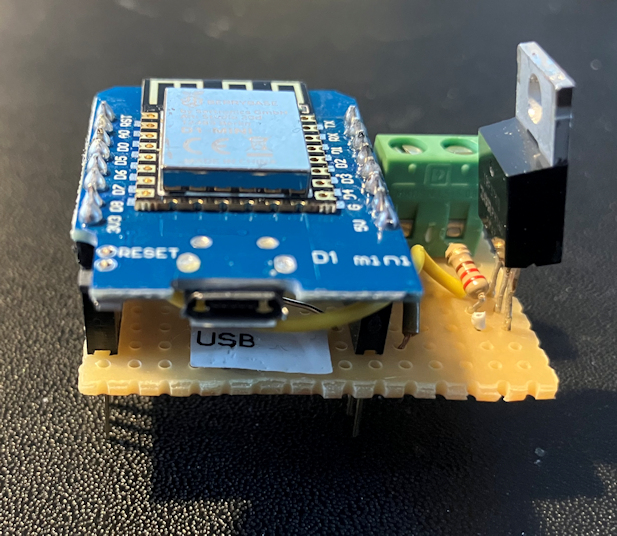
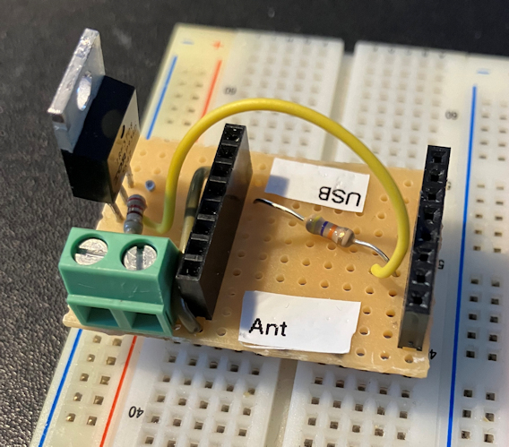
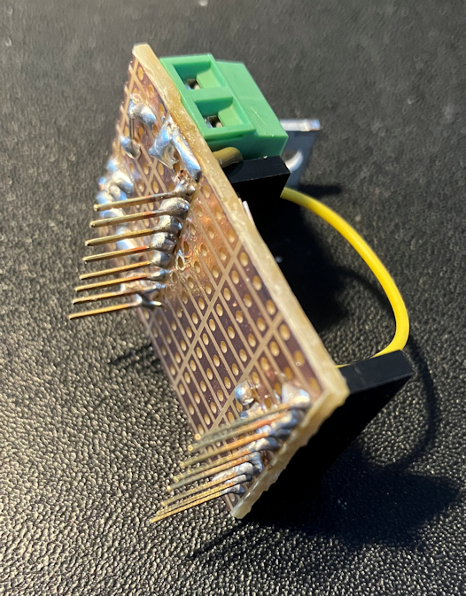
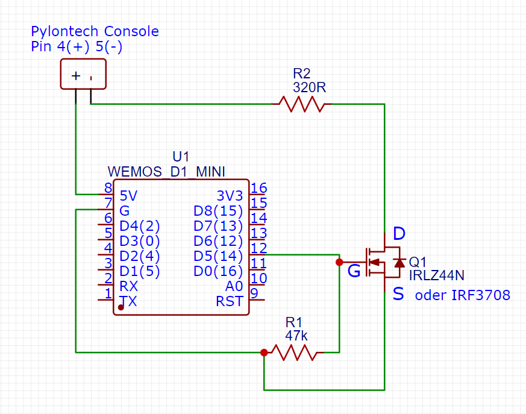
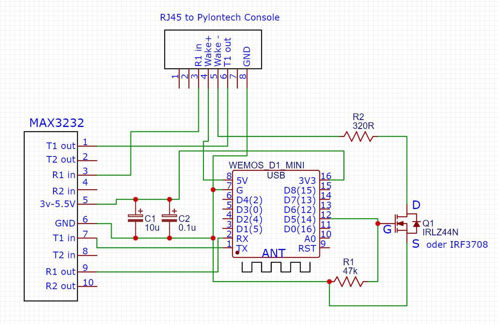

# Pylontech Wakeup Function for "C" Models like US2000C 
an addtion to and based on  
# Pylontech Battery Monitoring via WiFi by Ireneusz Zielinski [https://github.com/irekzielinski/Pylontech-Battery-Monitoring]

An Instructable in German can be found at [https://rustimation.eu]

Some time ago, Ireneusz Zielinski published his project on Github with which the battery can be monitored via WiFi. It essentially consists of an ESP8266 microcontroller (Wemos D1 Mini), a Max3232 transceiver, two capacitors, a remodelled network cable and a USB power supply. That's it! All essential information can be found on Github. Cost point 25 - 35€.

This allows the battery status to be read out interactively via a simple web interface and also manipulated within limits - for integration into IoT solutions, you can activate MQTT or send commands to a amall API that can also return the status information as JSON object. Both can be easily integrated into Node-Red, Home Assistant or other IoT platforms.

I am assuming that you already have built the original board and are using Ireneusz' software. If not, please consult Ireneusz' project at Github [https://github.com/irekzielinski/Pylontech-Battery-Monitoring].

In some cases you might want to shut down the battery during longer periods of standby or because there is an unwanted drain due to an inverter in standby (e.g. Hoymiles).

# Shutting Down The Battery
can be done by the existing software by issuing the command [http://IPAddress_of_D1_mini/req?code=shut]
However, afterwards you won't be able to restart the battery by means of the console software. 

# Restarting The Battery 
The Pylontech "C" models however, have two pins inside the console RJ45 port with a special purpose. If you supply a 5-12V, 5-15mA Signal for > 0.5 seconds to pin 4 (+) and pin 5 (-) you can restart the battery. If you build the little piece of hardware and use the code provided here, you will then be able to wake up the battery by issuing the command [http://IPAddress_of_D1_mini/wakeup]

# Extra HW Required
You already have the D1 Mini for Ireneusz solution, you'll need additionally
* 1 Logic Level n-channel MOSFET e.g. IRLZ44N or alternatively and possibly better IRF3708 (currently poorly available) or another Logic Level n-channel MOSFET
* 1 pull-down resistor with 47k Ohm
* 1 resistor with 220 or 320 Ohm
* Plus 1 pair of stacking headers - included in the D1 pack if you haven't thrown that away yet 😉
* 1 solderable terminal to attach the wires 4/5 that go to the console port.
* Small piece of dot/strip grid circuit board - preferably with 3 rows of dots - e.g. Rademacher 790
  
Cost is <5€

# Making a Piggyback Daughterboard
The board will go between the existing board from Ireneusz solution (assuming jou already have built it) and the D1 Mini.
It looks like this:

Provided that you haven't soldered the D1 Mini directly to the board. In that case you may need to solder cables directly to the D1: +5V, Gnd, D5
The schematics are as follows:

In Case you start from scratch, you can of course make a single board to interface to the console and wake it up as well:

# Code
I've added some lines to Ireneusz' Code without touching the original logic. They are commented by text like "added by ...." 
Unfortunately I lack the Git/Github expertise to show the original solution and my additions side by side.
# New Structure of "pwr-command" output
When using a new US5000 Pylontech battery I found that the JSON output as well as the MQTT output were showing 0V and an "Alarm" Status. This was obviously wrong, since the battery was working perfectly well.
Analyis showed that the structure of the pwr command output had changed.
For the JSON or MQTT output of PylontechMonitoring, the parameters in the pwr table are parsed according to their position in the respective line. For example, the baseState (Charge/Discharge/Idle/Balance) is now at position 91 instead of position 55, which naturally leads to greater confusion with the effect that JSON and MQTT do not work.
I have adapted Ireneusz program to reflect the new structure. See file **241211_Github_Pylon_Display_Wakeup_NewStructure.ino**

**ADDITIONALLY**, I have added some code to allow outputting the crucial batttery parameters (V, SoC, status) to a little SSD1306 display. If you don't want that, simply remove line 728. _LCD_display_loop();_ located in the _void loop();_ section.
